<div align="center">

# Financial Research Automation

### An Automated Platform for Quarterly Financial Analysis & PowerPoint Reporting of Listed IT Companies


---

</div>

# Overview

**Financial Research Automation** is a Python platform that removes the manual work of equity research. It automatically collects **quarterly financial results** of publicly listed IT companies (TCS, Infosys, Wipro, HCLTech, Tech Mahindra), cleans and structures the data, computes growth and margin analytics, draws charts, and generates a **ready-to-present PowerPoint report**, all from a single **"Run Full Analysis"** click in a Streamlit dashboard.

Instead of copying numbers into Excel, calculating growth by hand and building slides one by one, an analyst gets a finished report in under a minute.

> live demo click here: https://financial-research-automation-ajitdadagharge.streamlit.app/

---

# Key Features

- Automated web scraping of quarterly results (Selenium + BeautifulSoup)
- Automatic fallback to `requests` if Chrome is unavailable
- Clean, tidy data model (long to wide format)
- QoQ and YoY growth, net margin, CAGR, rolling averages
- Peer ranking and growth z-scores (NumPy)
- Auto-generated plain-English insights per company
- 10 Matplotlib charts (trends, comparisons, heatmap, per-company dual-axis)
- Automated 14-slide PowerPoint report (python-pptx)
- Interactive Streamlit dashboard with one-click execution
- Excel + CSV export of all processed data
- Offline demo mode and cached-scrape mode
- Fault tolerant: a failed company is skipped, raw HTML is saved for debugging

---

# System Architecture

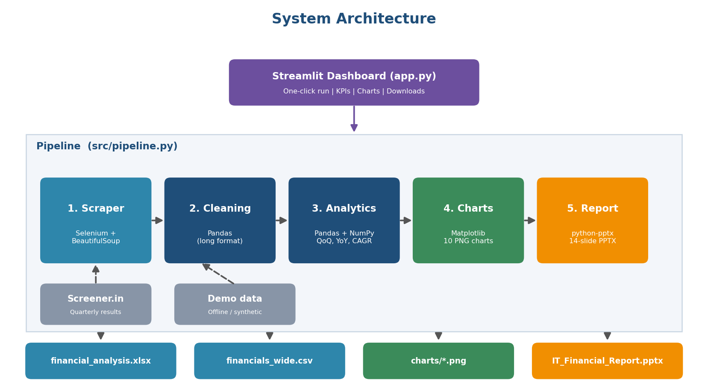

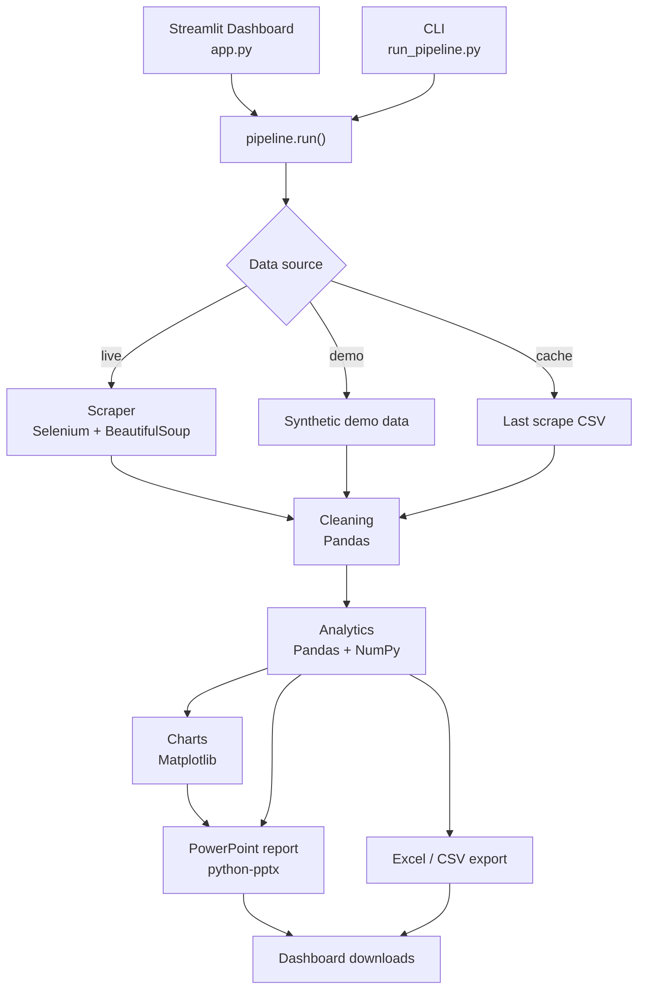

---

# Project Workflow

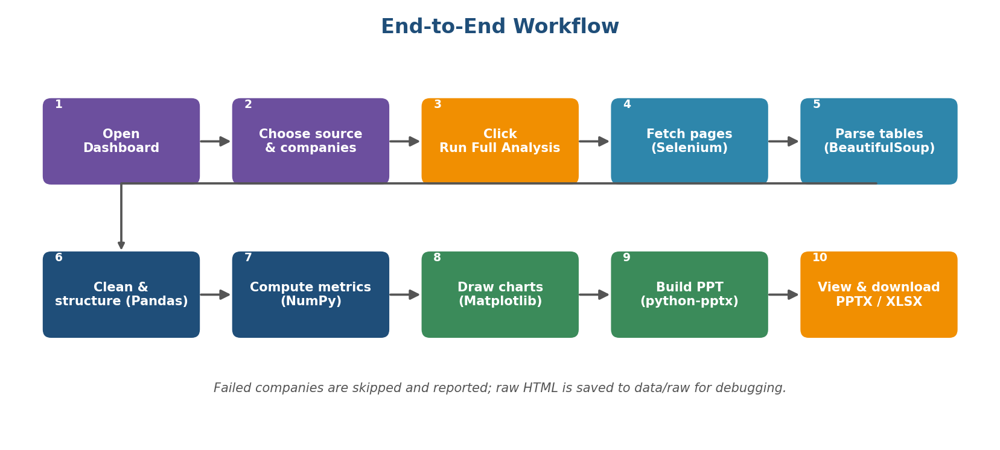

## Step 1: Launch

`run.bat` / `run.sh` creates a virtual environment, installs requirements and starts Streamlit.

## Step 2: Configure

In the sidebar the user picks the **data source**, **companies**, **number of quarters** and **fetch method**.

## Step 3: Collect

For each company, Selenium opens the company page in headless Chrome and waits for the quarterly table. BeautifulSoup extracts it into a tidy table of `Company | Quarter | Metric | Value`. The raw HTML is saved to `data/raw/`.

## Step 4: Clean and Structure

Pandas drops empty values, keeps the latest N quarters per company, and pivots to one row per company-quarter.

## Step 5: Analyse

Growth (QoQ, YoY), net margin, 4-quarter rolling average, CAGR, volatility, peer ranks and z-scores are computed with Pandas and NumPy. Rule-based text insights are generated.

## Step 6: Visualise and Report

Matplotlib saves the charts; python-pptx assembles them with tables and insights into a PowerPoint deck.

## Step 7: Deliver

The dashboard shows KPIs, charts and company insights, and offers the **PPTX** and **Excel** files for download.

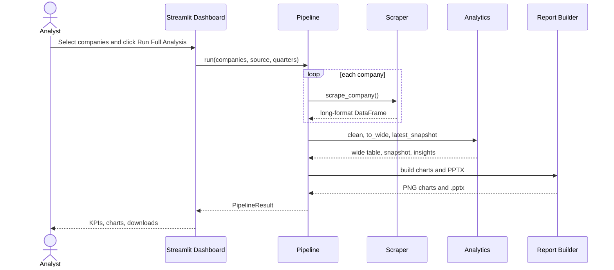

---

# Tech Stack

| Layer | Technology | Purpose |
|---------|------------|---------|
| Language | Python 3.9+ | Entire project |
| Web Automation | Selenium | Load pages in headless Chrome, wait for the table |
| HTML Parsing | BeautifulSoup + lxml | Extract the quarterly-results table |
| Fallback Fetch | requests | Used when Chrome is not installed |
| Data Processing | Pandas | Cleaning, pivoting, growth metrics, export |
| Numerical Analytics | NumPy | Z-scores, volatility, CAGR, safe maths |
| Visualisation | Matplotlib | Line, bar, heatmap and dual-axis charts |
| Report Generation | python-pptx | Automated PowerPoint deck |
| Dashboard | Streamlit | Interactive one-click UI |
| Export | openpyxl | Excel workbook |
| Testing | Python asserts / pytest | Parser, maths and pipeline tests |
| Version Control | Git / GitHub | Source control |

---

# Project Structure

```text
financial-research-automation/
│
├── app.py                  # Streamlit dashboard
├── run_pipeline.py         # Command-line runner
├── run.bat / run.sh        # One-click launchers
├── requirements.txt
│
├── src/
│   ├── config.py           # Paths, company list, metric map, colours
│   ├── scraper.py          # Selenium + BeautifulSoup scraper
│   ├── sample_data.py      # Synthetic offline demo data
│   ├── analytics.py        # Cleaning, growth metrics, insights
│   ├── charts.py           # Matplotlib charts
│   ├── ppt_builder.py      # python-pptx report
│   └── pipeline.py         # Orchestrator
│
├── tests/
│   └── test_pipeline.py
│
├── data/
│   ├── raw/                # Saved HTML of every scrape
│   └── processed/          # CSV and Excel outputs
│
├── outputs/
│   ├── charts/             # PNG charts
│   └── reports/            # Generated PowerPoint files
│
├── docs/
│   ├── Project_Documentation.docx
│   └── images/             # README images
│
└── README.md
```

---

# Data Model

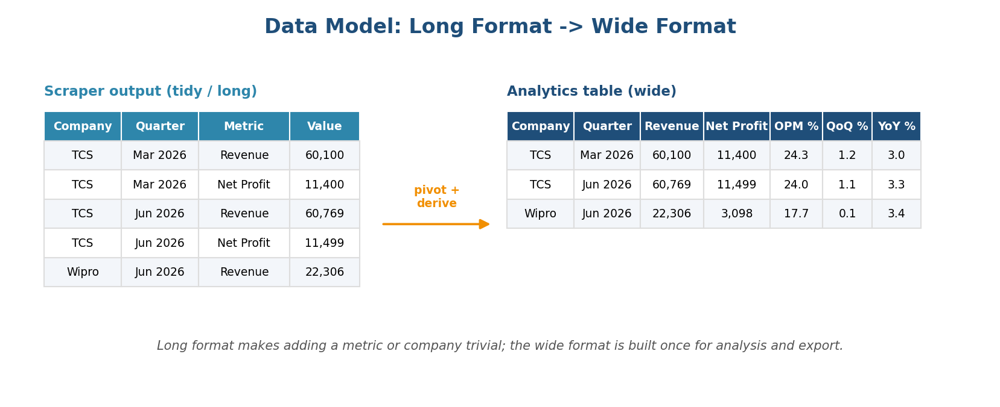

*(values above are illustrative)*

### Metrics scraped (Rs Crore unless noted)

```
Revenue, Expenses, Operating Profit, OPM %, Other Income,
Interest, Depreciation, PBT, Tax %, Net Profit, EPS
```

### Derived metrics

```
Revenue QoQ %      Revenue YoY %
Net Profit QoQ %   Net Profit YoY %
Net Margin %       Revenue 4Q Avg
CAGR               Volatility (std-dev of QoQ growth)
Revenue Rank       Margin Rank      Growth Z-Score
```

| Metric | Formula |
|--------|---------|
| QoQ % | `(this quarter / previous quarter - 1) x 100` |
| YoY % | `(this quarter / same quarter last year - 1) x 100` |
| Net Margin % | `Net Profit / Revenue x 100` |
| CAGR | `(last / first) ^ (1 / years) - 1` |
| Growth Z-Score | `(company YoY - peer mean) / peer std-dev` |

---

# Scraping Flow

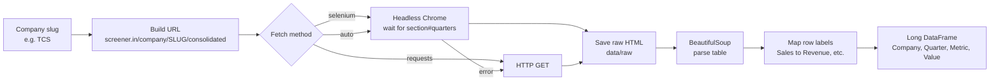

---

# Dashboard

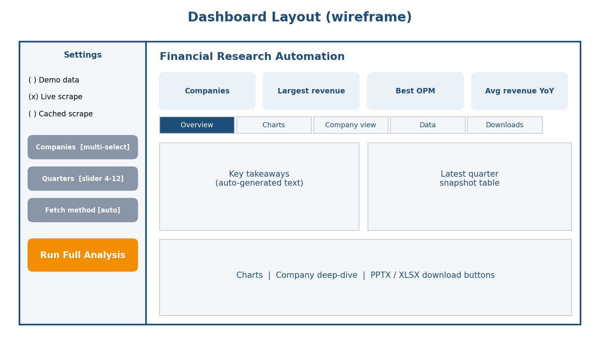

| Tab | What it shows |
|-----|---------------|
| Overview | Key takeaways and latest-quarter snapshot table |
| Charts | Revenue, margin, net profit, growth and heatmap charts |
| Company view | Per-company chart, insights and quarterly table |
| Data | Full analytics table with CSV download |
| Downloads | PowerPoint (.pptx) and Excel (.xlsx) |

---

# Charts Generated

| Revenue Trend | Operating Margin |
|:---:|:---:|
| 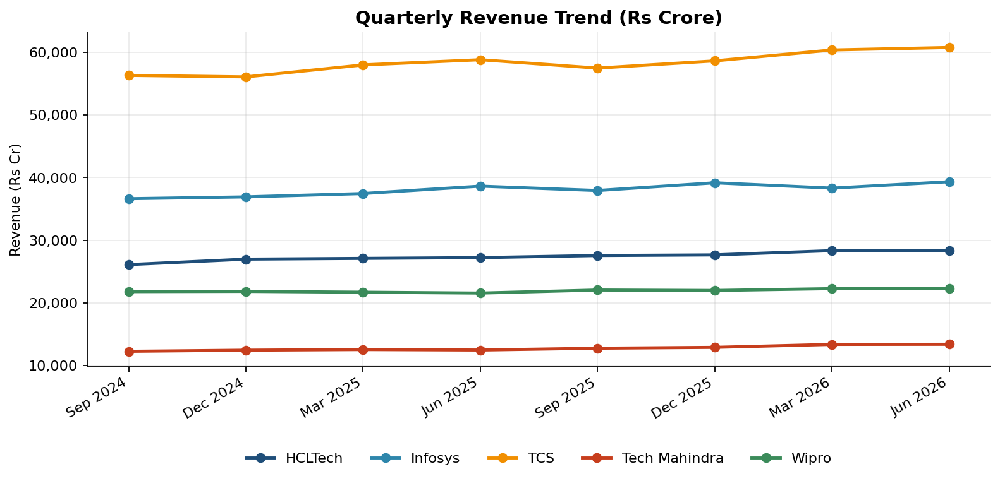 | 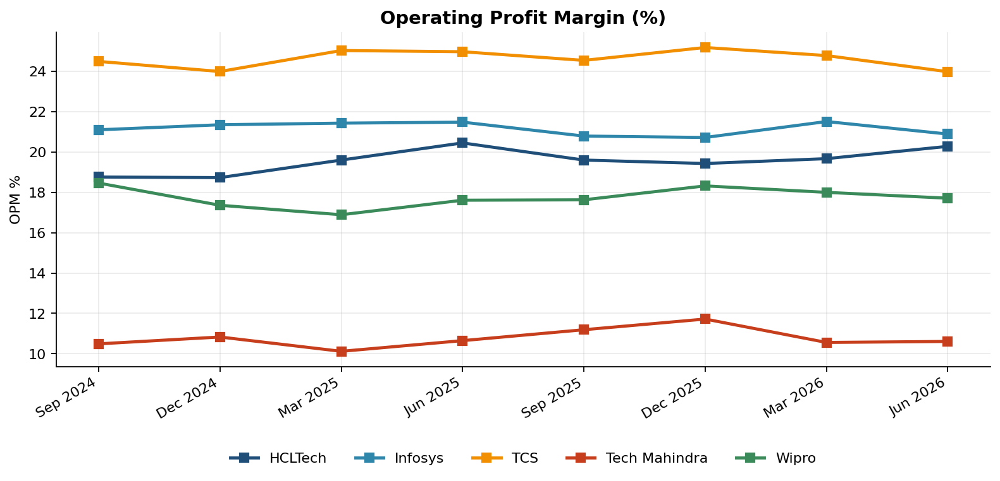 |

| Net Profit (Latest Quarter) | YoY Growth |
|:---:|:---:|
| 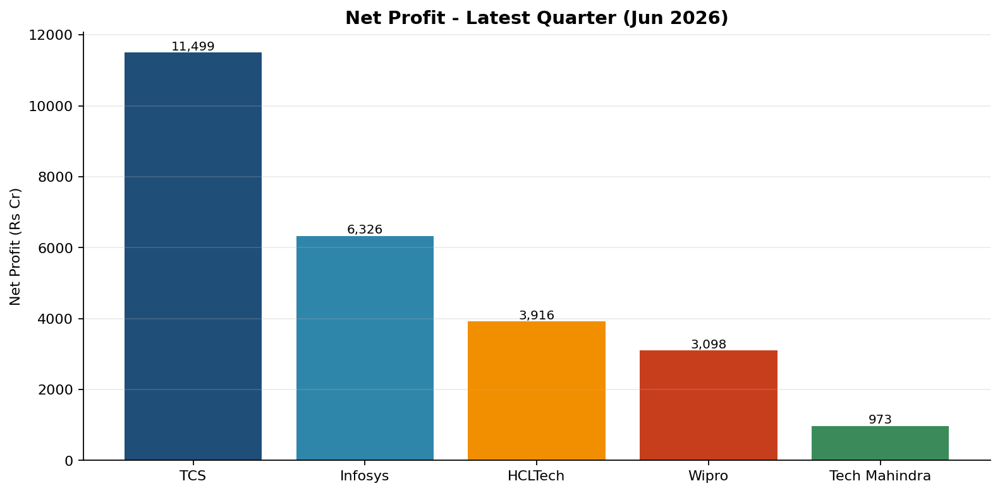 | 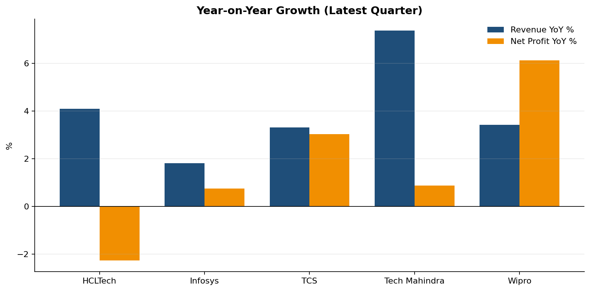 |

| QoQ Growth Heatmap | Company Deep-Dive (TCS) |
|:---:|:---:|
| 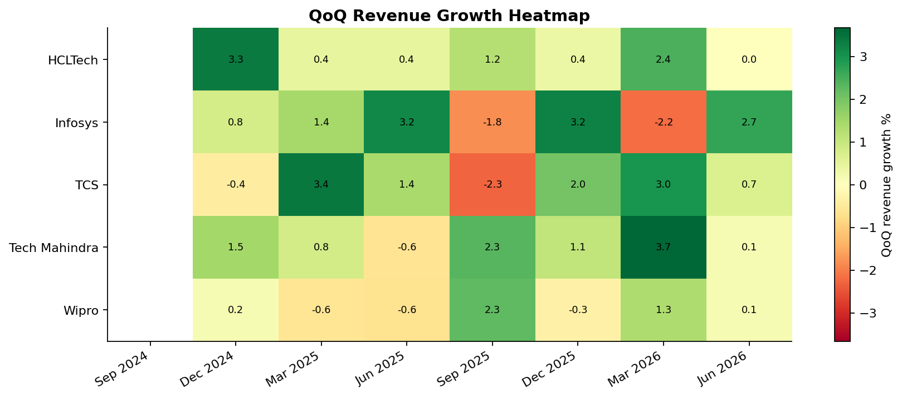 | 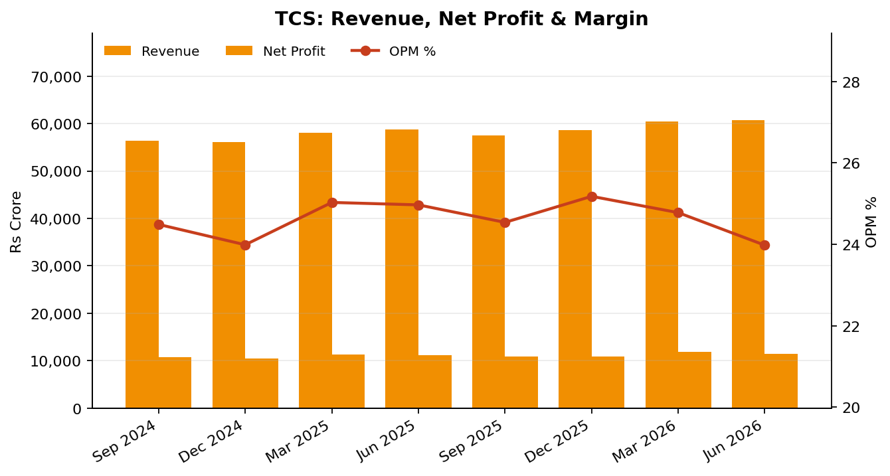 |

---

# Automated PowerPoint Report

The generated deck has **14 slides**: title, key takeaways, snapshot table, five comparison charts, one deep-dive slide per company, and methodology.

| Title | Key Takeaways | Snapshot Table |
|:---:|:---:|:---:|
| 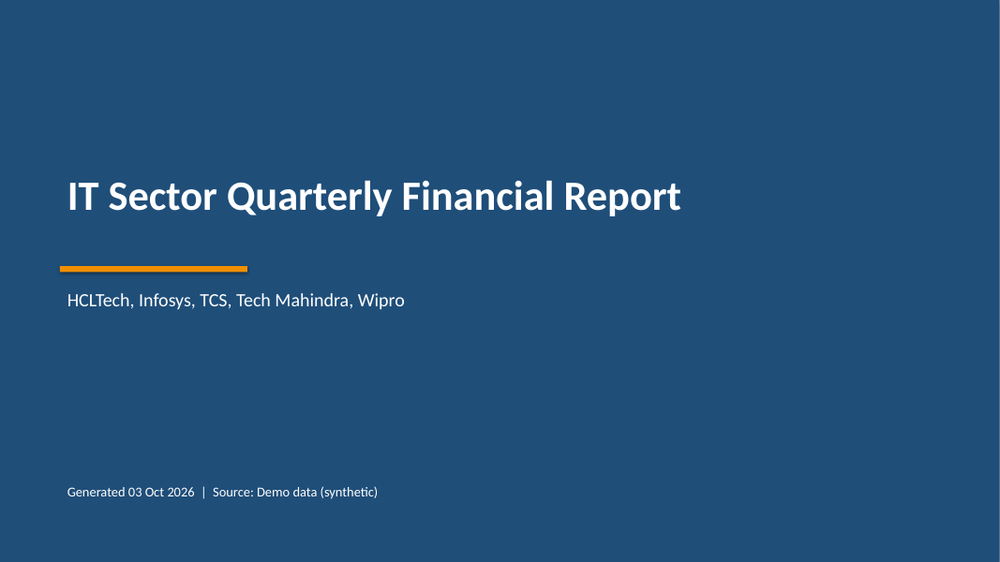 | 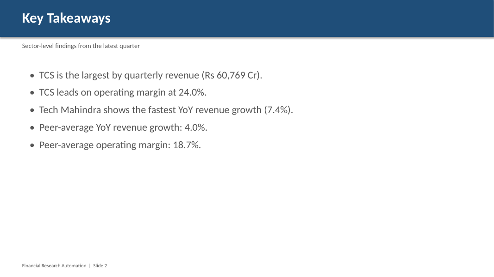 | 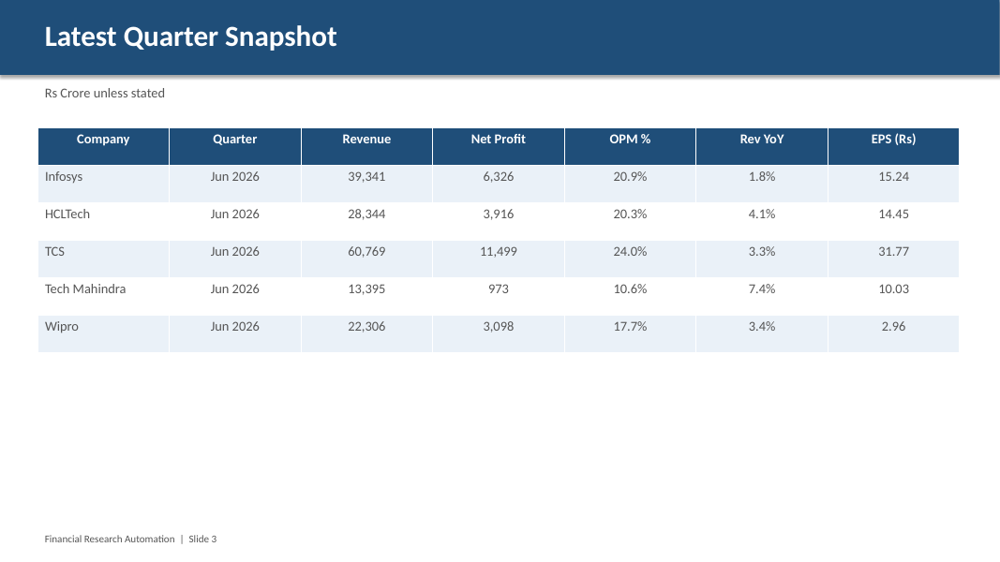 |

| Revenue Trend | Heatmap | Company Slide |
|:---:|:---:|:---:|
| 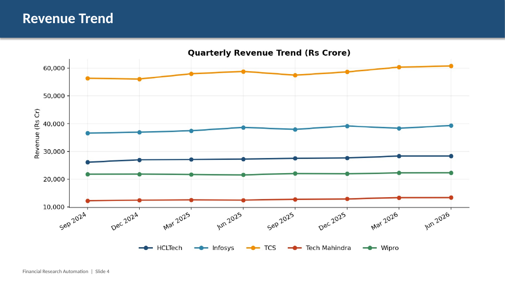 | 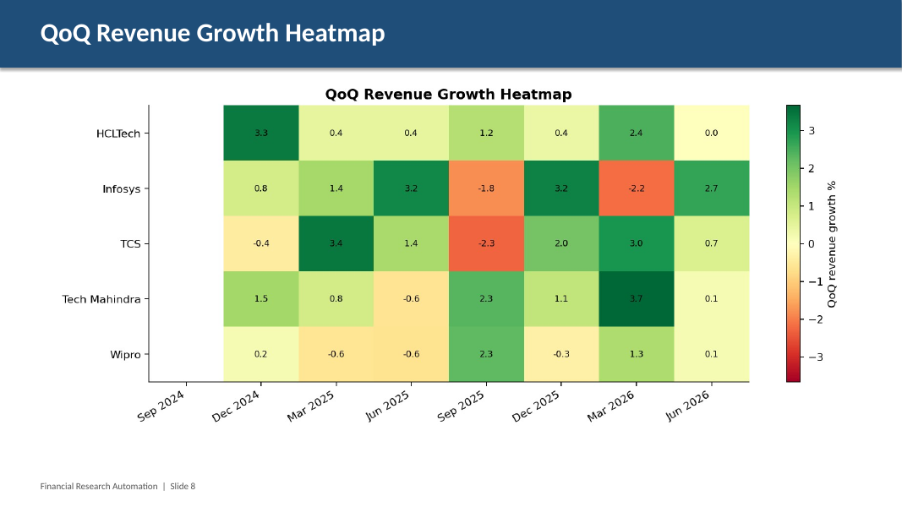 | 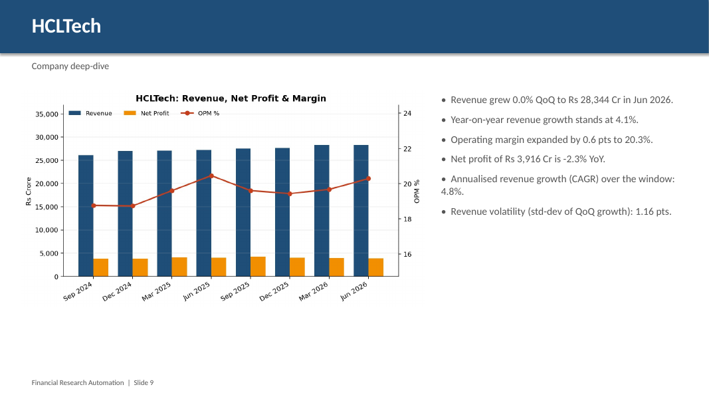 |

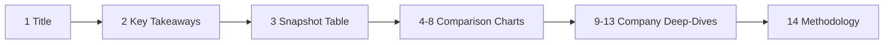

---

# Fault Tolerance and Design Decisions

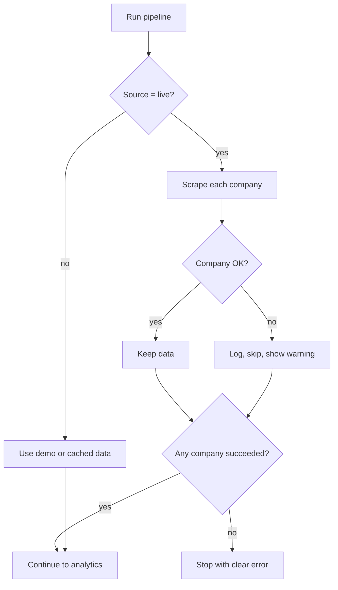

- **Selenium + BeautifulSoup:** Selenium renders and waits; BeautifulSoup extracts precisely.
- **requests fallback:** the tool still works without Chrome.
- **Raw HTML saved:** layout changes can be debugged offline.
- **Long format first:** adding a metric or company needs no code change in analytics.
- **Polite scraping:** one page per company with a 1-second delay.
- **Separation of concerns:** scraper, analytics, charts, report and UI are independent modules.

---

# Installation

### One click

**Windows:** double-click `run.bat`  
**macOS / Linux:** `./run.sh`

### Manual

```bash
git clone https://github.com/Ajitdada2575/financial-research-automation.git
cd financial-research-automation

python -m venv .venv
.venv\Scripts\activate            # macOS/Linux: source .venv/bin/activate
pip install -r requirements.txt

streamlit run app.py
```

### Command line

```bash
python run_pipeline.py                          # demo data
python run_pipeline.py --source live            # real scrape
python run_pipeline.py --source live --method requests --quarters 12
python tests/test_pipeline.py                   # tests
```

---

# Outputs

| File | Description |
|------|-------------|
| `outputs/reports/IT_Financial_Report_*.pptx` | Generated PowerPoint report |
| `outputs/charts/*.png` | All charts |
| `data/processed/financial_analysis.xlsx` | Snapshot, quarterly and raw sheets |
| `data/processed/financials_wide.csv` | Analytics table |
| `data/raw/*.html` | Raw page saved from each live scrape |

---

# Limitations

- Data is taken from a third-party site; check its terms of use before heavy or commercial scraping.
- If the site changes its HTML layout, update `parse_quarterly_table()` in `src/scraper.py`.
- Scraped figures are unaudited. The report is informational and **not investment advice**.
- Insights are rule-based summaries of computed metrics, not forecasts.

---

# Future Improvements

- More companies and sectors
- Balance sheet and cash-flow analysis
- Valuation ratios (P/E, ROE) and peer comparison
- Interactive Plotly charts
- Scheduled weekly auto-refresh and email delivery of the report
- Deployment on Streamlit Community Cloud
- Sentiment analysis of earnings news

---

# My Contribution

I designed and built the complete project end to end.

- Built an **automated financial analysis platform** to extract, structure and analyse quarterly financial data from publicly listed IT companies, eliminating manual data collection.
- Designed an **end-to-end data analytics pipeline** for data processing, financial insight generation and automated visualization-rich **PowerPoint report** generation.
- Developed an interactive **Streamlit dashboard** enabling one-click execution, financial analysis and visualization of company-level insights.

---

<div align="center">

### If you like this project, don't forget to star the repository!

**Python, Selenium, BeautifulSoup, Pandas, NumPy, Matplotlib, Streamlit and python-pptx**

</div>
